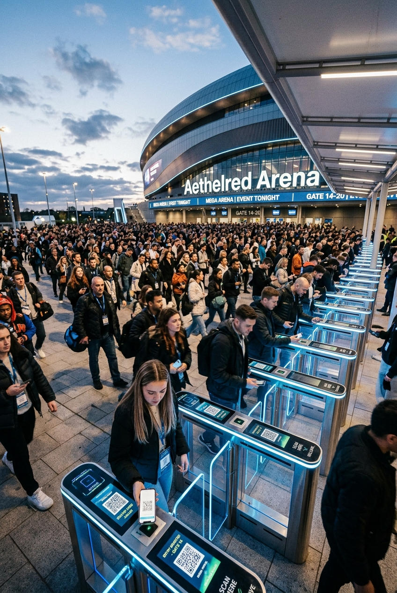
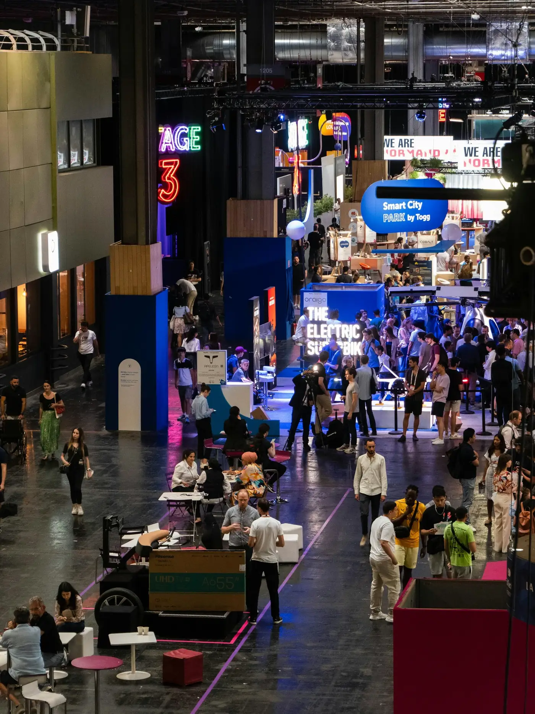

<div align="center">

  

  <br />
  <br />

  <h1>idexi: Intelligent Event Solutions</h1>

  <p>
    <strong>Next-generation physical space intelligence, AI-powered access control, and instant face-recognition photo delivery.</strong>
  </p>

  <p>
    <a href="https://nextjs.org"></a>
    <a href="https://react.dev"></a>
    <a href="https://www.typescriptlang.org"></a>
    <a href="https://www.framer.com/motion"></a>
    <a href="./LICENSE"></a>
  </p>

  <p>
    <a href="#-core-ai-services">Core Services</a> •
    <a href="#-interactive-features">Interactive Features</a> •
    <a href="#-engineered-for-every-venue">Venues</a> •
    <a href="#-tech-stack">Tech Stack</a> •
    <a href="#-getting-started">Getting Started</a> •
    <a href="#-our-story">Our Story</a>
  </p>

</div>

---

## 📖 Overview

**idexi** bridges physical and digital friction in live event environments. Built by event management veterans and AI engineers, idexi transforms corporate summits, music festivals, expos, and galas from chaotic logistical hurdles into seamless, intelligent experiences.

```
                  ┌─────────────────────────────────────────────────┐
                  │                 idexi Ecosystem                 │
                  └───────┬─────────────────┬─────────────────┬─────┘
                          │                 │                 │
                          ▼                 ▼                 ▼
                   ┌──────────────┐  ┌──────────────┐  ┌──────────────┐
                   │  idexi Face  │  │  idexi Flow  │  │  idexi Pass  │
                   │ Instant AI   │  │ Zero-Hardware│  │ Smart Digital│
                   │ Photo Deliv. │  │ Access Ctrl  │  │ Ticketing    │
                   └──────────────┘  └──────────────┘  └──────────────┘
```

---

## ⚡ Core AI Services

### 1. 📷 [idexi Face](http://localhost:3000/services/face) — *Attendee Delight*
> **Instant AI photo sorting & private gallery delivery.**

<p align="center">
  
</p>

- **3-Second Guest Registration**: Attendees take a quick selfie upon signup or entry.
- **Real-Time Photo Indexing**: As event photographers capture moments, the AI engine indexes and matches faces within seconds.
- **Private Automated Inbox Delivery**: Attendees receive their personal branded gallery via email while still at the event.

---

### 2. ⚡ [idexi Flow](http://localhost:3000/services/flow) — *Operational Intelligence*
> **Zero-hardware staff access control and event flow logistics.**

<p align="center">
  
</p>

- **Turn Any Phone into a Scanner**: Zero expensive proprietary handheld scanners needed. Staff and volunteers scan using their personal smartphones.
- **0.3s Instant Verification**: Ultra-fast camera check-ins with visual VIP status, session access, and meal ticket verification.
- **Real-Time Gate Telemetry**: Live density tracking, re-entry prevention, and staff coordination.

---

### 3. 🎟️ [idexi Pass](http://localhost:3000/services/pass) — *Frictionless Entry*
> **Smart encrypted digital ticketing and express check-in.**

<p align="center">
  
</p>

- **Dynamic Encrypted QR Passes**: Anti-screenshot, rotating QR credentials that prevent fraud and gate delays.
- **Multi-Tier Credentialing**: Custom access rules for Speakers, VIPs, Media, General Admission, and Crew.
- **Offline Mode Resiliency**: Local edge cryptographic validation keeps gates moving even if venue Wi-Fi drops.

---

## ✨ Interactive Features & Hero Showcase

<p align="center">
  
  
  
</p>

- 🎬 **Kinetic Photo Cluster & Marquee Hero**: Snappy 25fps kinetic typography with floating editorial photography and seamless scrolling ticker wordmarks.
- 📱 **Integrated Event Lifecycle Stage**: Interactive 4-step accordion timeline featuring 3D flip passes, laser scanner cycles, and live photo particle delivery.
- 🌗 **Dual-Theme Glassmorphism**: High-contrast floating pill navigation with fluid dark and light modes, backdrop saturation blurs, and scroll progress indicators.

---

## 🏛️ Engineered For Every Venue

<p align="center">
  
  
  
  
  
</p>

- **Corporate Summits**: Express check-ins and live intelligence for high-profile keynotes.
- **Music Festivals**: Manage high-density gates and monitor safety in real-time.
- **Conferences & Expos**: Automate lead capture and attendee journey tracking.
- **Gala & Private Events**: Automatic private photo albums delivered to each guest.
- **Universities & Graduations**: Handle graduation crowds and get every graduate their memories.

---

## 🛠️ Tech Stack

| Layer | Technology | Description |
| :--- | :--- | :--- |
| **Framework** | [Next.js 15 (App Router)](https://nextjs.org/) | Turbo-powered Server & Client Component Architecture |
| **Language** | [TypeScript 5](https://www.typescriptlang.org/) | End-to-end type safety |
| **Styling** | Custom Vanilla CSS Design System | Modern tokens (`--st-*`), Glassmorphism, Zero CSS framework bloat |
| **Animation** | [Framer Motion](https://www.framer.com/motion/) + Handcrafted CSS | 60fps micro-animations & kinetic transforms |
| **Icons** | [Lucide React](https://lucide.dev/) | Clean, accessible SVG iconography |
| **Typography** | Outfit, Inter, Sora, Playfair Display | Modern editorial typography |

---

## 🚀 Getting Started

### Prerequisites
- Node.js 18.17+ or later
- npm, yarn, pnpm, or bun

### Installation

1. **Clone the repository:**
   ```bash
   git clone https://github.com/MahmoudEsawi/idexi.git
   cd idexi
   ```

2. **Install dependencies:**
   ```bash
   npm install
   ```

3. **Run the development server:**
   ```bash
   npm run dev
   ```

4. **Open your browser:**
   Navigate to [http://localhost:3000](http://localhost:3000)

### Production Build

```bash
npm run build
npm start
```

---

## 🏷️ Repository Topics

`ai-events` • `facial-recognition` • `event-management` • `access-control` • `smart-ticketing` • `nextjs` • `react19` • `framer-motion` • `glassmorphism` • `design-system` • `event-tech` • `typescript`

---

## 👥 Our Story

<p align="center">
  
  
</p>

Born from 8 years of frontline event management and media coverage experience, **idexi** was founded by AI graduates **Saif Alqdessi** *(Co-Founder, Tech Lead)* and **Jafar Alkhadrawi** *(Co-Founder, Business Lead)* to eliminate ticketing errors, automate photo delivery, and put intelligence back into physical spaces.

---

<div align="center">
  <p>© 2026 idexi. All rights reserved.</p>
</div>
